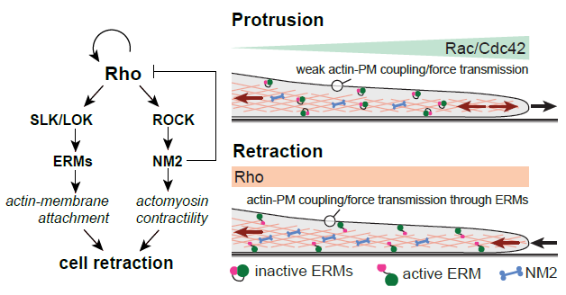

# Excitable Rho dynamics control cell shape and motility by sequentially activating ERM proteins and actomyosin contractility
[Seph Marshall-Burghardt](https://orcid.org/0009-0000-7634-9768), [Rodrigo Migueles-Ramirez](https://orcid.org/0000-0002-6087-1348), [Qiyao Lin](https://orcid.org/0009-0003-6436-9237), [Nada El Baba](https://orcid.org/0000-0002-2658-8426), [Rayan Saada](), [Mustakim Umar](), [Kian Mavalwala](https://orcid.org/0009-0009-9631-9852), [Arnold Hayer](https://orcid.org/0000-0001-7808-8880)

- Reference to the main article: [Marshall-Burghardt *et.al.*, 2024, Science Advances]()
- Data can be found [here](https://doi.org/10.20383/103.01016).

## Navigating the repository 
All code used in the data processing/analysis found in the paper is present here. Certain script and function packages are used multiple times throughout the paper and have their own unique folders, whereas panel-specific scripts are found in the folder 'figure panel specific scripts and instructions'.  Step-by-step instructions listing all scripts used for each panel can be found in the README files in 'figure panel specific scripts and instructions'. 

## MATLAB toolboxes 
Running this code requires the following MATLAB toolboxes: curve fitting, image processing, statistics and machine learning, as well as [Statistical Learning Toolbox](https://www.mathworks.com/matlabcentral/fileexchange/12333-statistical-learning-toolbox?s_tid=FX_rc2_behav) by Dahua Lin. 
## Edge Tracking 
Code used for cell tracking for edge velocity analysis was adapted with gratitude from the following study: 
Yang, H., Collins, S. & Meyer, T. Locally excitable Cdc42 signals steer cells during chemotaxis. Nat Cell Biol 18, 191–201 (2016). https://doi.org/10.1038/ncb3292 

## Add reference to Cappell et al. 2016

This code also uses ANN:Approximate Nearest Neighbours Version 1.1.2. Copyright (c) 1997-2010 University of Maryland and Sunil Arya and David
Mount. http://www.cs.umd.edu/~mount/ANN/ 
## Use of violin plots 
Violin plots for data visualization were created in part with thanks to:
> Bechtold, Bastian, 2016. Violin Plots for Matlab, Github Project  
> https://github.com/bastibe/Violinplot-Matlab, DOI: 10.5281/zenodo.455984

## Understanding file names
### Default naming convention
Using the "jobs" feature of the Nikon HCS software, the microscope takes a set number of images per well and stores the images as TIFF files in folders named using the R_C_S format where R and C are the row and the column index in the 96-well plate, respectively, and S is the index of sites. This is followed by the channel name or abbreviation (i.e.: 2_3_1_CFP.tiff). When the jobs feature was not used, primary data is stored in ND2 files, and then converted to TIFF files following this naming convention. You will see this format in most of the data.
### Alternative naming convention
For certain figures, including Fig. 7 and Fig. S8c, we used a different naming convention.  Files acquired using the jobs feature were grouped together under a single folder and renamed. The corresponding codes for these sections use the following convention: 
Each file key is YYMMDD-FF-SSS-CC-WW-CNDTN-TT-CHNL where:
* YYMMDD: Acquisition date
* FF: File index
* SSS: Site index
* CC: Crop index (when applicable)
* WW: Well index (Ex.: B3)
* CNDTN: Well name (experimental condition nickname)
* TT: Treatment duration (in hours)
* CHNL: Channel name

